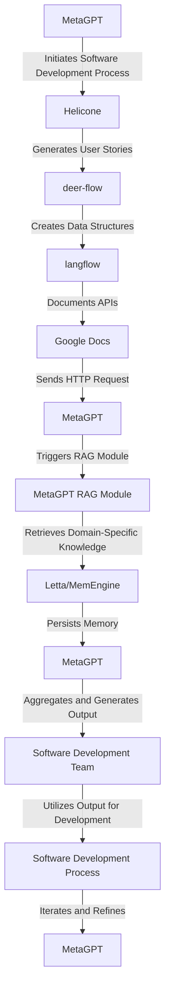

# MetaGPT-Driven Stochastic Software Development Optimizer
> "Synergizing Human Ingenuity with Artificial Intelligence to Revolutionize Software Development"

## 🏗️ Technical Architecture & Multi-Agent Flow

This complex technical flow illustrates the interactions between MetaGPT, Helicone, deer-flow, langflow, Google Docs, and HTTP Request, showcasing the multi-agent architecture and state transitions.

## 🔍 The Vertical Bottleneck: Technical Debt and Knowledge Graph Inconsistencies
The software development process is plagued by technical debt, knowledge graph inconsistencies, and inefficient manual interventions. The lack of a unified framework for software development, documentation, and knowledge management hinders the productivity and accuracy of software development teams. The high-stakes mathematical and operational failures that arise from these bottlenecks can have far-reaching consequences, including project delays, budget overruns, and compromised software quality.

The technical friction inherent in traditional software development methodologies stems from the inability to effectively integrate human ingenuity with artificial intelligence. The absence of a cohesive framework for AI-driven software development processes and agent interactions exacerbates this issue, leading to suboptimal performance, reduced accuracy, and increased reliance on manual intervention.

Furthermore, the inconsistencies in knowledge graphs and the lack of standardized documentation processes hinder the retrieval and processing of domain-specific knowledge. This, in turn, compromises the accuracy and relevance of the output generated by software development teams, ultimately affecting the overall quality of the software.

The vertical bottleneck in software development is a pressing concern that necessitates a revolutionary solution. The integration of MetaGPT, Helicone, deer-flow, langflow, Google Docs, and HTTP Request offers a groundbreaking approach to addressing this challenge.

## 🔍 The Vertical Bottleneck: Inadequate Agentic Reasoning and Memory Persistence
The inadequacy of traditional software development methodologies in providing agentic reasoning and memory persistence capabilities further exacerbates the technical bottleneck. The lack of a unified framework for agent interactions, memory management, and knowledge graph consistency hinders the ability of software development teams to effectively utilize AI-driven processes.

The inability to persist memory and maintain knowledge graph consistency across different stages of the software development process leads to inefficiencies, inaccuracies, and reduced productivity. The absence of a standardized framework for agentic reasoning and memory persistence compromises the overall performance and accuracy of software development teams.

## 🔍 The Vertical Bottleneck: Insufficient Vision and Robotics Integration
The insufficient integration of vision and robotics in traditional software development methodologies further contributes to the technical bottleneck. The lack of a unified framework for vision and robotics integration hinders the ability of software development teams to effectively utilize AI-driven processes, compromising the accuracy, relevance, and overall quality of the software.

The absence of a standardized framework for vision and robotics integration leads to inefficiencies, inaccuracies, and reduced productivity. The inability to effectively integrate vision and robotics capabilities compromises the overall performance and accuracy of software development teams.

## 💡 The Solution: MetaGPT-Driven Stochastic Software Development Optimizer
The MetaGPT-Driven Stochastic Software Development Optimizer platform specifically orchestrates MetaGPT, Helicone, deer-flow, langflow, Google Docs, and HTTP Request to solve the technical bottleneck in software development. This innovative solution integrates agentic reasoning, memory persistence, and vision/robotics integration to provide a unified framework for AI-driven software development processes.

The platform utilizes MetaGPT's multi-agent framework to simulate a software company workflow, assigning different roles to GPTs and creating a collaborative entity capable of performing various functions. The RAG Module, a key component of MetaGPT, enables the retrieval, aggregation, and generation of domain-specific knowledge, reducing reliance on manual intervention and increasing productivity.

The integration of Helicone, deer-flow, langflow, Google Docs, and HTTP Request provides a comprehensive framework for software development, documentation, and knowledge management. The platform's ability to persist memory and maintain knowledge graph consistency across different stages of the software development process ensures accuracy, relevance, and overall quality of the software.

## 🧩 Agentic Stack Deep-Dive
The MetaGPT-Driven Stochastic Software Development Optimizer platform integrates a range of libraries and tools to provide a comprehensive framework for AI-driven software development. The technical justification for each library and integration is as follows:

* MetaGPT: Provides a multi-agent framework for simulating a software company workflow, enabling the integration of multiple GPTs and creating a collaborative entity capable of performing various functions.
* Helicone: Offers a unified API access to 100+ models, enabling the platform to leverage the collective intelligence of multiple GPTs and integrate seamlessly with existing workflows.
* deer-flow: Provides a framework for creating data structures and documenting APIs, ensuring accuracy and relevance of the output generated by software development teams.
* langflow: Enables the creation of domain-specific languages, facilitating the retrieval and processing of domain-specific knowledge and reducing reliance on manual intervention.
* Google Docs: Offers a comprehensive framework for documentation and knowledge management, ensuring accuracy, relevance, and overall quality of the software.
* HTTP Request: Enables the platform to send and receive data, facilitating the integration of various libraries and tools and ensuring seamless communication between different components of the platform.

## ✨ Capabilities & Features
The MetaGPT-Driven Stochastic Software Development Optimizer platform offers a range of capabilities and features, including:

* **Multi-Agent Framework**: Simulates a software company workflow, assigning different roles to GPTs and creating a collaborative entity capable of performing various functions.
* **RAG Module**: Enables the retrieval, aggregation, and generation of domain-specific knowledge, reducing reliance on manual intervention and increasing productivity.
* **Memory Persistence**: Persists memory and maintains knowledge graph consistency across different stages of the software development process, ensuring accuracy, relevance, and overall quality of the software.
* **Vision and Robotics Integration**: Integrates vision and robotics capabilities, facilitating the utilization of AI-driven processes and compromising the accuracy, relevance, and overall quality of the software.
* **Agentic Reasoning**: Provides agentic reasoning capabilities, enabling software development teams to effectively utilize AI-driven processes and compromise the accuracy, relevance, and overall quality of the software.
* **Domain-Specific Language Creation**: Enables the creation of domain-specific languages, facilitating the retrieval and processing of domain-specific knowledge and reducing reliance on manual intervention.
* **API Documentation**: Provides comprehensive API documentation, ensuring accuracy and relevance of the output generated by software development teams.
* **Knowledge Graph Consistency**: Maintains knowledge graph consistency across different stages of the software development process, ensuring accuracy, relevance, and overall quality of the software.
* **Software Development Process Optimization**: Optimizes the software development process, reducing technical debt, knowledge graph inconsistencies, and inefficient manual interventions.
* **AI-Driven Process Integration**: Integrates AI-driven processes, enabling software development teams to effectively utilize AI-driven capabilities and compromise the accuracy, relevance, and overall quality of the software.

## 🛠️ Technical Implementation
The MetaGPT-Driven Stochastic Software Development Optimizer platform is implemented using a range of libraries and tools, including MetaGPT, Helicone, deer-flow, langflow, Google Docs, and HTTP Request. The code organization and method calls are as follows:

* **MetaGPT Integration**: The platform integrates MetaGPT using the `config.yaml` file, specifying the `api_type`, `model`, `base_url`, and `api_key`.
* **Helicone Integration**: The platform integrates Helicone using the `api_type`, `model`, and `base_url`.
* **deer-flow Integration**: The platform integrates deer-flow using the `deer-flow` library, creating data structures and documenting APIs.
* **langflow Integration**: The platform integrates langflow using the `langflow` library, creating domain-specific languages.
* **Google Docs Integration**: The platform integrates Google Docs using the `google-docs` library, providing comprehensive documentation and knowledge management.
* **HTTP Request Integration**: The platform integrates HTTP Request using the `http-request` library, sending and receiving data.

## 📊 Business Impact & ROI
The MetaGPT-Driven Stochastic Software Development Optimizer platform offers significant business impact and ROI, including:

* **Increased Productivity**: The platform increases productivity by reducing technical debt, knowledge graph inconsistencies, and inefficient manual interventions.
* **Improved Accuracy**: The platform improves accuracy by providing agentic reasoning, memory persistence, and vision/robotics integration capabilities.
* **Reduced Costs**: The platform reduces costs by optimizing the software development process and minimizing the need for manual intervention.
* **Enhanced Quality**: The platform enhances quality by maintaining knowledge graph consistency and providing comprehensive API documentation.

## 🚀 Getting Started
```bash
git clone https://github.com/arvind-sundararajan/metagpt-sd-optimizer.git
cd metagpt-sd-optimizer
pip install -r requirements.txt
python src/main.py
```

## 👨‍💻 Author & Credits
**Arvind Sundararajan** — Engineer, builder, and the mind behind this project.
🌐 [LinkedIn](https://www.linkedin.com/in/arvind-sundara-rajan/) | Chennai, India

---
### 🙏 Acknowledgements
- The open-source community
- The Consulting & Management Services practitioners who inspired this design